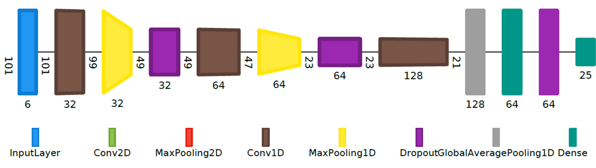
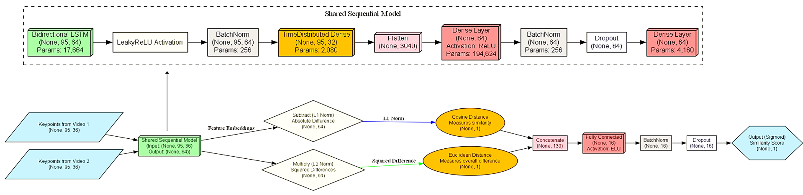
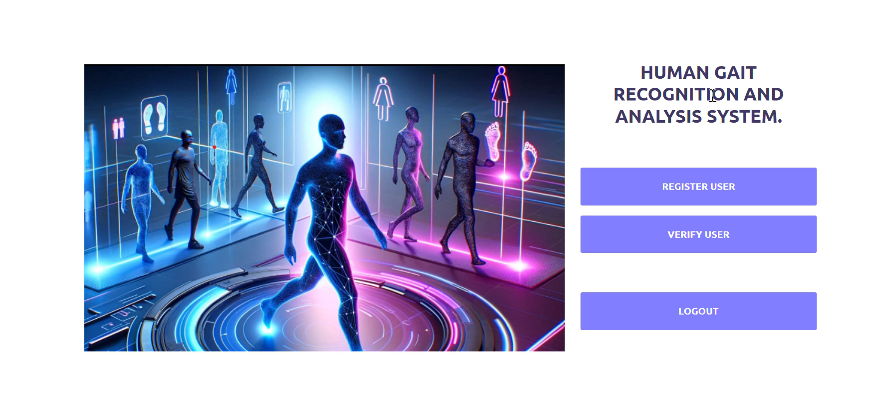
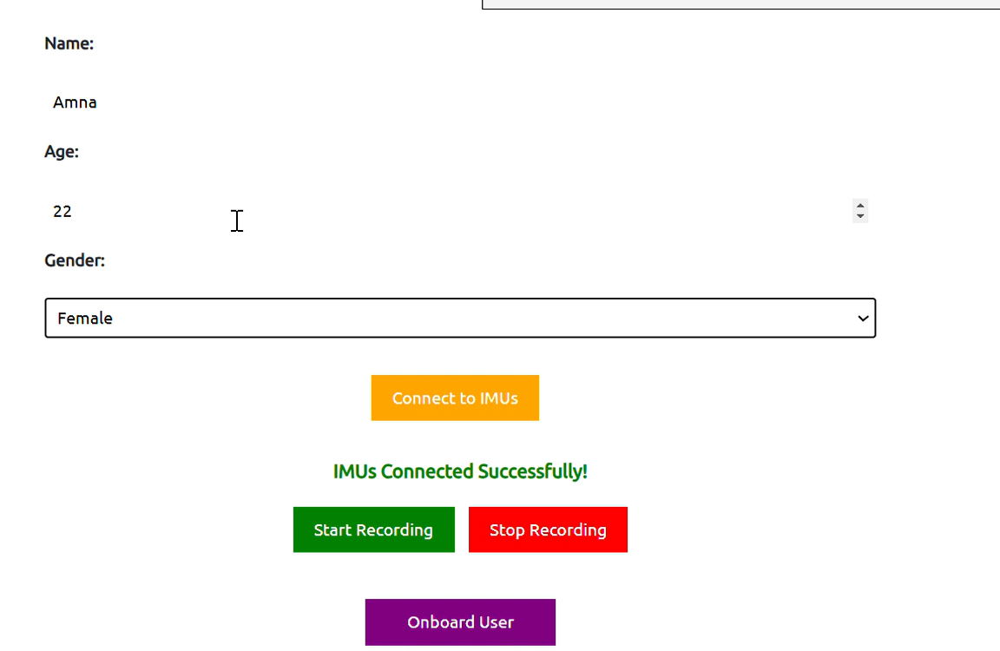
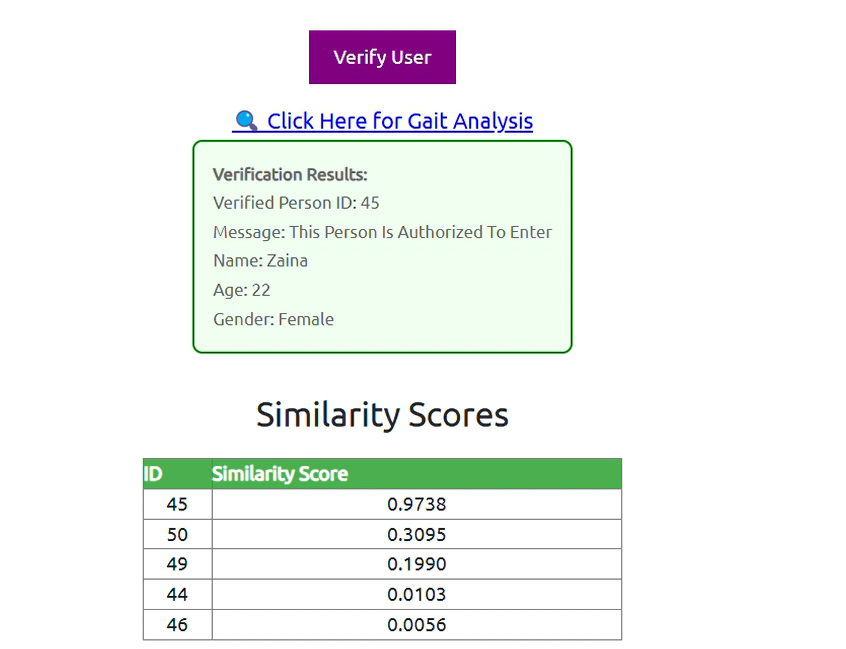
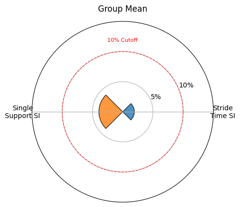
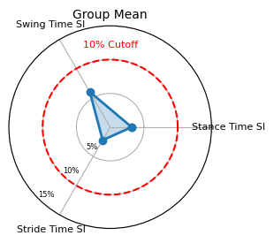

# 🦿 Gait Analysis Application

A multimodal gait analysis system combining **sensor-based** and **video-based** models to extract, analyze, and interpret gait features for user identification and movement assessment.

---

## 🚀 Features

- 📱 Sensor-based gait recognition using IMU data  
- 🎥 Video-based gait analysis using pose estimation  
- 🔗 Multi-modal fusion for improved accuracy  
- 👤 User registration and verification system  
- 📊 Insightful visualizations of gait data

---

## 🧱 Prerequisites

Before running the app, make sure you have the following:

- Python **3.8+**
- TensorFlow **2.9**
- Protobuf **3.20**
- Virtual environment setup (recommended)

---

## 📦 Installation

### 1. Clone the Repository

```bash
git clone https://github.com/zaina1864/Multimodal-Gait-Recognition.git
cd Multimodal-Gait-Recognition
```

### 2. Set Up Virtual Environment

```bash
python -m venv venv
source venv/bin/activate         # On Windows: venv\Scripts\activate
pip install -r requirements.txt
```

---

## 🔍 Model Files

Model files are not included in the repo due to size limitations.

1. [Download from Google Drive](https://drive.google.com/drive/folders/1xjIoS_BFGaal67BSdMveRRKEc5V1wOQe?usp=sharing)  
2. Extract if necessary  
3. Place the `model/` folder inside the `Multimodal-Gait-Recognition/` directory

---

## 🧪 Running the Application

```bash
source venv/bin/activate         # Or: venv\Scripts\activate
python app.py
```

Open the app in your browser to begin.

---

## 🧰 How to Use

### 👤 Register a User
- Open the app in browser
- Go to the **Registration Page**
- Fill in the required details and submit

### ✅ Verify a User
- Log in using your registered credentials
- The system will authenticate and verify you

### 📈 Analyze Gait Data
- Upload either **sensor** or **video** data
- The app will process the input and display **gait analysis results**

---


## 🧠 Model Architecture Overview
Shows how the sensor and video models fuse to classify gait type.




---

## 🖱️ Gait Analysis UI – Upload & Analyze
Main interface where users sign up to register a new user and verify an existing user for processing.




---

## ✅ Verification Results
Displays verification and classification result after processing input data.



---

## 📊 Gait Feature Analysis – Group Mean Symmetry Index (SI)

The following figures compare the **Group Mean Symmetry Index (SI)** values for two critical gait features — **Stride Time** and **Stance Time** — using data from both **IMU sensors** and **video-based models**.

### 📈 IMU-Based Symmetry Index
This figure displays the mean SI values calculated from IMU sensor data.



---

### 📈 Video-Based Symmetry Index
This figure shows the corresponding SI values using video-based gait analysis.



> ✅ Lower SI values indicate more symmetric gait. These plots demonstrate that both modalities capture gait symmetry accurately, with minor variation in precision.

---


## 🛠️ Troubleshooting

- **Protobuf conflicts**: Make sure you're in the correct virtual environment before running the app.
- Ensure all model files are placed correctly under the `model/` directory.

---

## 🤝 Contributing

Contributions are welcome!  
Feel free to fork the repo and submit a pull request with improvements.

---

## 📄 License

This project is licensed under the [MIT License](LICENSE).

---

## ✨ Acknowledgments

Thanks to the ADU research lab and all contributors for guidance and support throughout the development of this application.
